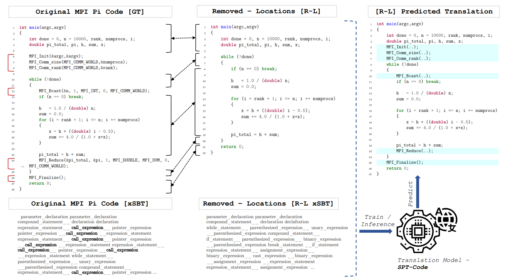

# MPI-rical: Data-Driven MPI Distributed Parallelism Assistance with Transformers
Message Passing Interface (MPI) plays a crucial role in distributed memory parallelization across multiple nodes. However, parallelizing MPI code manually, and specifically, performing domain decomposition, is a challenging, error-prone task. In this paper, we address this problem by developing MPI-RICAL, a novel data-driven, programming-assistance tool that assists programmers in writing domain decomposition based distributed memory parallelization code. Specifically, we train a supervised language model to suggest MPI functions and their proper locations in the code on the fly. We also introduce MPICodeCorpus, the first publicly available corpus of MPI-based parallel programs that is created by mining more than 15,000 open-source repositories on GitHub. Experimental results have been done on MPICodeCorpus and more importantly, on a compiled benchmark of MPI-based parallel programs for numerical computations that represent real-world scientific applications. MPI-RICAL achieves F1 scores between 0.87-0.91 on these programs, demonstrating its accuracy in suggesting correct MPI functions at appropriate code locations.
Overall, our approach represents a significant step forward in advising MPI code through distributed memory systems writing, which can save valuable time and resources for software developers and researchers.
          
## Desired Objective  ##

A data-oriented workflow of the MPI-rical system, exemplified by a distributed Pi calculation code: Given a corpus of MPI codes, a subset of the original dataset is created --- Removed - Locations [R-L] --- in which the MPI functions are replaced by a void and the original locations are not preserved. This is also done to the xSBT representations. Accordingly, the subset [R-L] is used to train a translation model, SPT-Code, which will eventually predict the desired MPI classification for new samples of codes given in those fashions. As such, MPI-rical is useful in easing the writing of MPI codes in IDEs.

## MPI-rical Training and Evaluation  ##

Overview of the model's training and evaluation. The dataset is created from MPICodeCorpus while three files constitute one example; MPI C code (label), MPI C code functions excluded, and its X-SBT (linearized AST). Our model, MPI-rical, trains and evaluates these examples. MPI-rical was pre-trained from the CodeSearchNet dataset.


# Instructions
## Requirments
First, clone the MPI-rical code provided here, the dataset subsets and SPT-Code.
```
clone https://github.com/Scientific-Computing-Lab-NRCN/MPI-rical.git
```
Then, two conda environments have to be created; SPTcode and code2mpi.
```
conda create --name <env_name> --file SPTcode
```
Then, activate your environment:
```
conda activate <env_name>
```
Download the right packages according to the official SPT-Code github: https://github.com/NougatCA/SPT-Code
and the following packages inside code2mpi environment:
```
pycparser
matplotlib
scikit-learn==0.24.2
scipy==1.7.3
python==3.7
```
code2mpi is used to pre-process and analyze the data while SPTcode is used to train and evaluate the models.


## Citation
For more information about the measures and their means of the implementations, please refer to the paper.
If you found these codes useful for your research, please consider citing: https://arxiv.org/abs/2305.09438

## Dataset
The corpus is located [here](https://drive.google.com/file/d/1lRTSbh9aitI4BdWxPI8reLpJV4WnlIWQ/view?usp=sharing)
It contains folders in the following tree structure:
```
├── User1
│   ├── Repository1
│       ├── Program1
│       ├── Program2
│       └── Outputs
│   └── Repository2
│       ├── Program1
│       └── Outputs
├── User2
│   ├── Repository1
│       ├── Program1
│       ├── Program2
│       ├── Program3
│       └── Outputs
```
1. **User** - The github's user.
2. **Repository** - One of the repositories of the current user.
3. **Program** - Contains one C main program and its headers files.
4. **Outputs** - Contains main file after preprocess and main program's AST pickle file if AST has been successfully generated.


Please note, that the pickle file can easily be created by wrapping code.c with a int main() {} and applying the pycparser parser.  

In addition, the database contains a json file that maps the folders -- each key in the json file represents a corpus record: user name, repository name, a unique id for each program and its path.
This json file can be recreated with the make/database.py script.
The three mentioned dataset-subsets have been created using the corpus.


## Running
### Configuration
Change the paths in config.yaml file to the relevant paths:
```
REPOS_ORIGIN_DIR: '/home/yourname/MPI-rical/DB/git_repos'
REPOS_MPI_DIR: '/home/yourname/MPI-rical/DB/repositories_MPI'
PROGRAMS_MPI_DIR: '/home/yourname/MPI-rical/DB/programs'
DB_DIR: '/home/yourname/MPI-rical/DB'
MPI_DIR: '/home/yourname/MPI-rical/DB/MPI'
MPI_SERIAL_DIR: '/home/yourname/MPI-rical/DB/MPI_SERIAL'
MPI_SERIAL_HEURISTICS_DIR: '/home/yourname/MPI-rical/DB/MPI_SERIAL_HEURISTICS'
MPI_SERIAL_PLACEHOLDER_DIR: '/home/yourname/MPI-rical/DB/MPI_SERIAL_PLACEHOLDER'
```
### Evaluate
To evaluate the models activate the SPTcode environment and enter the source folder: 
```
conda activate SPTcode
cd Desktop/MPI-rical/SPT-Code/Source
```
Download the MPI-rical model [here](https://drive.google.com/file/d/1usQHuqN7V0QbBx0VF23vNqmGgEQdsgmE/view?usp=drive_link).
Move it to the SPT-code/outputs folder and then run the following:
* For evaluating Translation [R-L]:
```
python main.py --only-test --task translation --translation-source-language serial_c --translation-target-language mpi_c --no-nl --batch-size 32 --max-code-len 320 --trained-vocab '/home/nadavsc/LIGHTBITS/SPT-Code/dataset/pre_trained/vocabs' --trained-model '/home/nadavsc/LIGHTBITS/SPT-Code/outputs/5_epochs_320_translation/models'
```
Make sure to insert the right paths of both the model itself and the pre trained vocabs.

