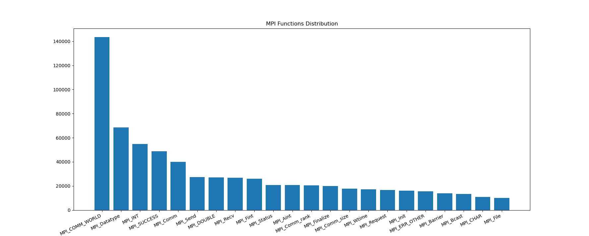

# Automatic Distributed Parallelism with MPI
Automatic source-to-source parallelization of serial code for shared and distributed memory systems is a challenging task in high-
performance computing. While many attempts were made to trans-late serial code into parallel code for a shared memory environment - usually using OpenMP - none has managed to do so for a distributed memory environment. The evolving field of AI-based pro-gramming assistance tools, on the other hand, shows a promising direction that could offer an opportunity for developing a translator for serial code in distributed memory environment. In this paper, we propose a novel approach, called MPI-rical, for automated MPI code generation using a transformer-based model trained on approximately 25,000 serial code snippets (in C language) and their corresponding parallelized MPI code out of more than 50,000 code snippets in our corpus (MPICodeCorpus). In order to evaluate the performance of the model systematically, we first break down the serial code to MPI-based parallel code translation problem into two sub-problems and develop two research objectives: code completion defined as given a location in the source code, predict the MPI function for that location, and code translation defined as predicting an MPI function as well as its location in the source code. We evaluate MPI-rical on MPICodeCorpus dataset and on real-world scientific code benchmarks and compare its performance between the code completion and translation tasks. Our experimental results show
that while MPI-rical performs better on the code completion task than the code translation task - with an F1-score of 0.95 against
0.87 - the latter is better suited for real-world programming assistance, in which the tool suggests the need for an MPI function regardless of prior knowledge. Overall, our approach represents a significant step forward in automating the parallelization of serial
code for distributed memory systems, which can save valuable time and resources for software developers and researchers.
          
## End-to-End Automatic Parallelization  ##

# Future Plans
In order to preprocess the data for a language model, pairs of MPI and serial/OpenMP code is required. This can be achived by both deterministic tools like CATO or OMP2MPI and also from the following proposed heuristics.

## MPI to Serial Heuristics
Example to a few of the proposed heuristics:

# Dataset
Load repositories including MPI from github between range of dates and extraction of the following statistics:

